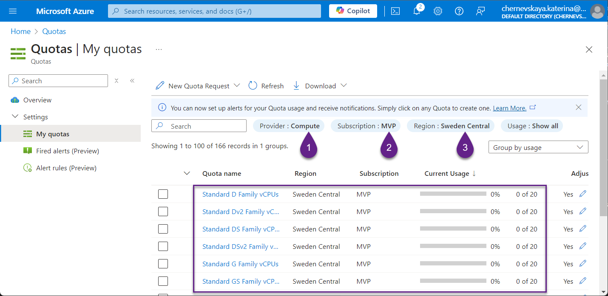

# Baltic Summit 2024 - Workshop
# Enhancing Chatbot Intelligence with Azure AI Studio's Prompt Flow

In today's digital landscape, chatbots are vital for customer service, support, and engagement. Their effectiveness, however, depends on their ability to precisely understand and respond to user inquiries. This challenge often stems from limited backend configurations that fail to capture the nuances of human communication. Our workshop addresses this critical issue by utilizing Azure AI Studio’s Prompt Flow, which offers extensive customization, evaluation, measurement, and control capabilities for the backend processes of AI solutions. We aim to equip you with the necessary tools to boost chatbot intelligence, ensuring they are responsive and effective across various interactions.

## Prerequisites

To ensure you are fully prepared for this engaging workshop, please meet the following prerequisites:

1. **Laptop Requirement.** Bring a laptop equipped with a modern browser and Wi-Fi capability.

2. **Azure Subscription.** Access to an Azure subscription is essential for participating in the core labs.
Set up a free trial on Azure if you don’t already have an account. Visit 
https://azure.microsoft.com/free to start a free trial. We recommend using a dedicated Azure subscription (a trial version is sufficient) for the workshop. This allows you to experiment freely without impacting your corporate or production resources.

3. **Check Azure Quota.**

Checking your Azure quota is critical to ensure you have sufficient resources to create and run services during the workshop. Please check quota for `Machine Learning` and `Compute` providers following these steps:

   - Login to Azure Portal and navigate to the Quotas page [here](https://portal.azure.com/#view/Microsoft_Azure_Capacity/QuotaMenuBlade/~/myQuotas).
   - Check **Machine Learning** provider quota by filter parameters:
     - Provider: `Machine Learning`
     - Subscription: select your subscription
     - Region: `Sweden Central`
   - Verify available quota for D-series VMs.
   
   - Check **Compute** provider quota by filter parameters:
     - Provider: `Compute`
     - Subscription: select your subscription
     - Region: `Sweden Central`
   - Verify available quota for D-series VMs.
   
   - **Request a quota increase if needed:** Click the pencil icon to initiate a quota increase request if you find the quota is insufficient.

> If you encounter a message stating that the resource provider is not registered, follow these steps before rechecking the quota:
> 1. Log into the Azure portal and navigate to your subscription settings.
> 2. Go to the `Resource providers` section.
> 3. Type `quota` in the search field and select the `Microsoft.Quota` provider.
> 4. Click `Register` and wait for the process to complete.
> 5. Ensure the `Microsoft.Compute` provider is registered. If not, register it.
> 6. After registration, recheck your quota availability as previously outlined.
> 

This proactive approach to preparing for the workshop will help you maximize your learning experience and practical application during the session.

## Preparatory Learning

Enhance your understanding of Azure fundamentals by exploring the **Azure Mastery: Building Smarter Bots** series available through LinkedIn or this repository: https://github.com/Katerina-Chernevskaya/azure-mastery. This series is ongoing, so keep an eye on new content and updates to stay current. Familiarize yourself with the core terms and concepts that we will use and explore during the workshop. This foundational knowledge will help you engage more effectively in the learning activities and practical applications.