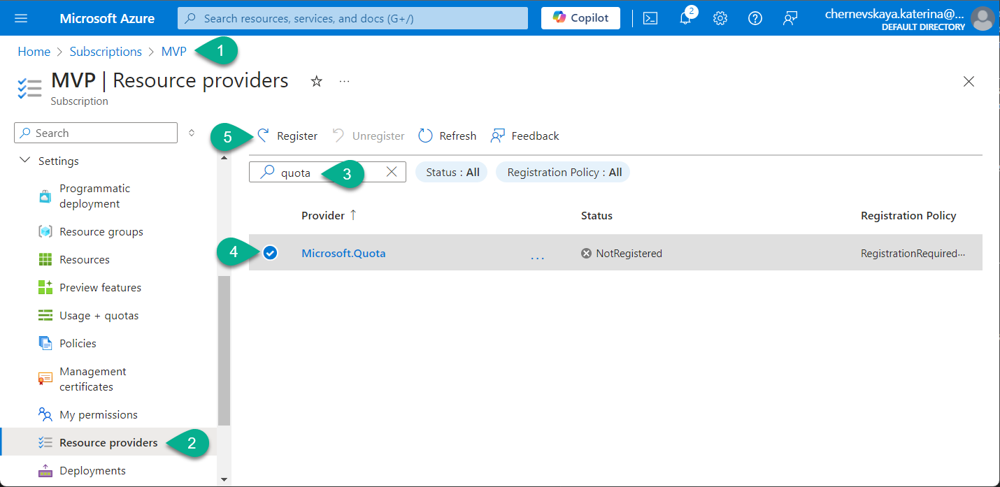
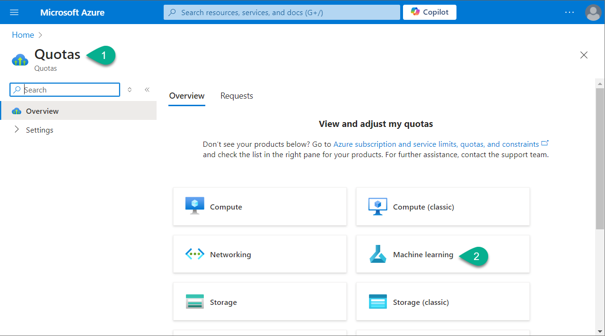
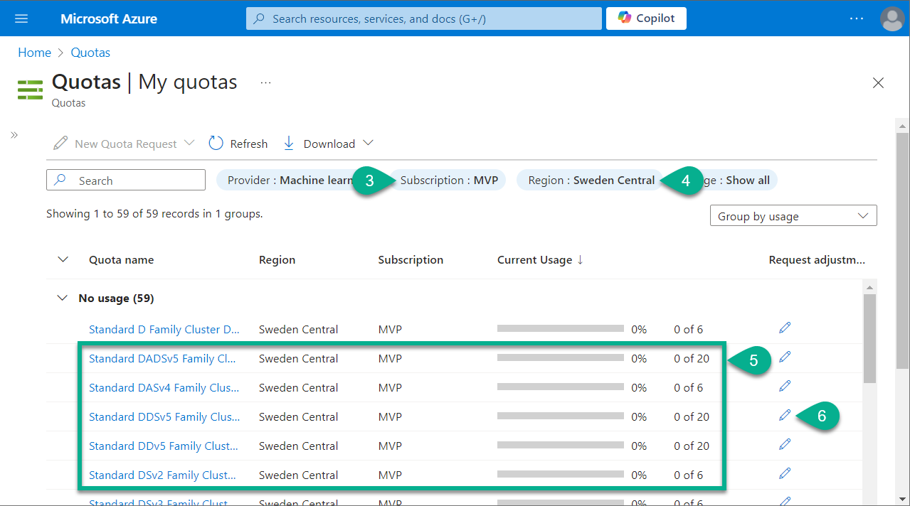
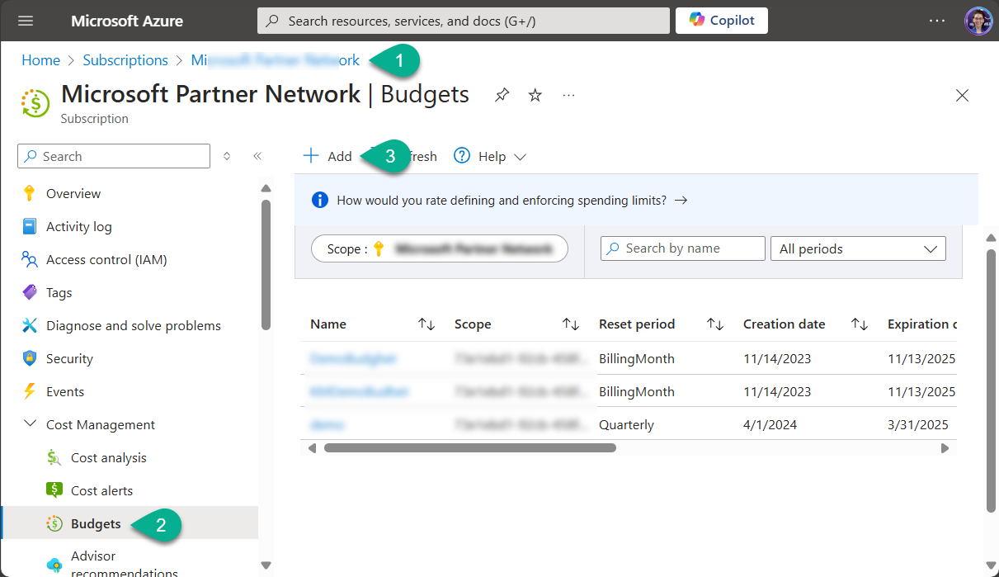
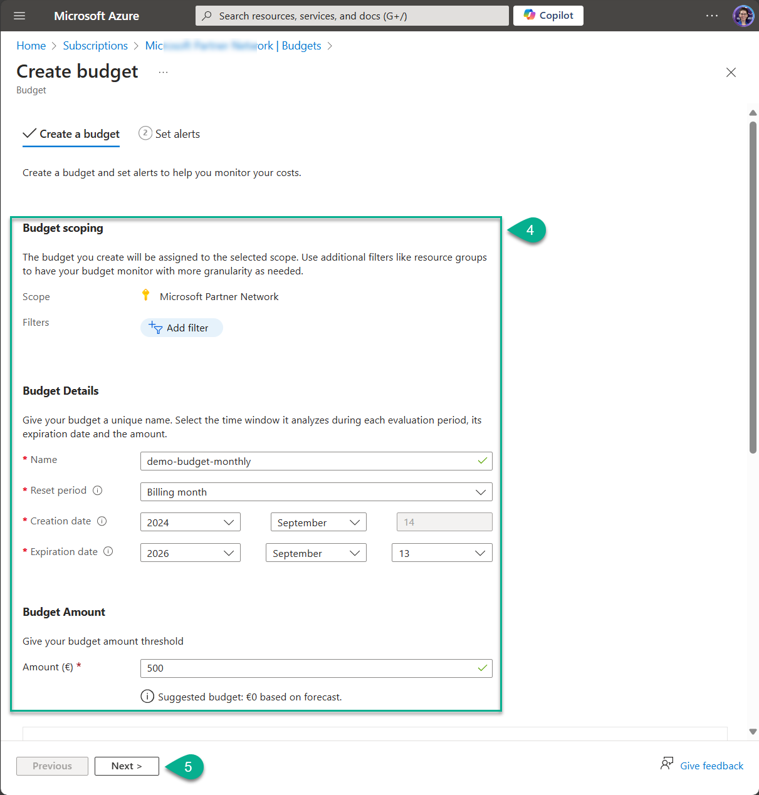
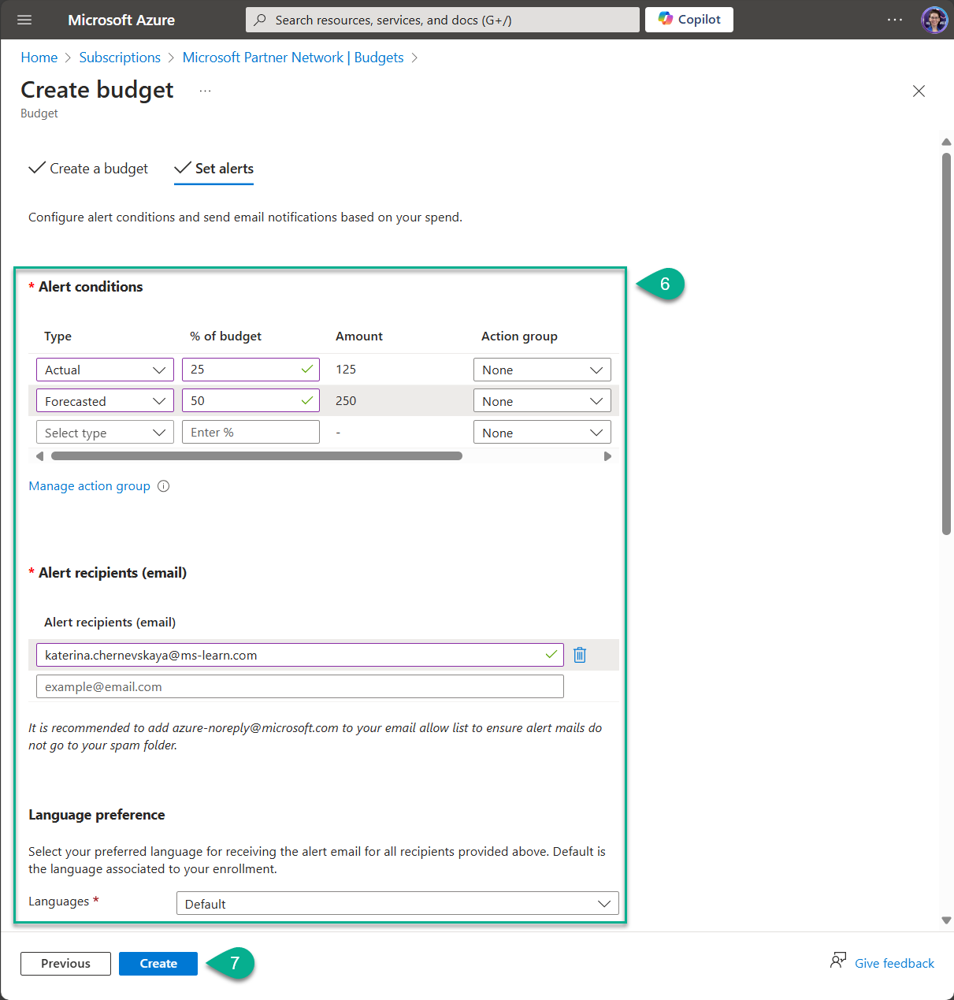

# Lab 1. Prepare your Azure subscription

_This is the first lab in the workshop, designed to prepare your Azure subscription for smooth resource deployment. In this lab, we will verify the required quota and request an increase if necessary, register resource providers, and set up a budget._

***

## 1-1. Register Resource Providers

_In this part we are going to register Resource providers for the Azure subscription. 
Azure services and resources are grouped under different providers. Each provider offers a set of operations and capabilities. By registering the appropriate providers, you enable your subscription to access and deploy the corresponding resources, such as virtual machines, databases, or storage, ensuring you can use the required services for your deployment._

We need to register the following Resource providers:

1. Microsoft.Quota
2. Microsoft.CognitiveServices
3. Microsoft.Storage
4. Microsoft.MachineLearningServices
5. Microsoft.Search
6. Microsoft.AlertsManagement
7. Microsoft.PolicyInsights
8. Microsoft.Authorization

Please follow these steps to register each Resource provider:

1. Navigate to your dedicated Azure subscription.
2. Scroll down and find `Resource providers`.
3. In the search field enter name of the Resource provider you want to check and register.
4. If the status of the particular Resource provider is `NotRegistered`, select this provider.
5. Click on `Register` button to start the registration process.

Wait for the registration process to complete. This may take a few minutes.

Repeat for all eight Resource providers from the above list.

***

## 1-2. Check ML Quotas for Azure subscription

_Checking the quota for the Machine Learning provider is important before resource deployment to ensure your Azure subscription has sufficient capacity to allocate the necessary resources. If your quota is too low, resource deployment may fail, causing delays or incomplete setups. By verifying the quota beforehand, you can request an increase if needed, avoiding potential disruptions and ensuring a smooth deployment of machine learning resources like compute clusters or virtual machines._

Please follow these steps to check the quota for Machine Learning provider:

1. Navigate to the [Quotas](https://portal.azure.com/#view/Microsoft_Azure_Capacity/QuotaMenuBlade/~/overview) page in Azure portal.
2. Select the `Machine Learning` provider.
3. Select your dedicated Azure subscription.
4. Select the `Sweeden Central` region.
5. Check that there is available quota for D-series VM.
6. If no available quota - please request quota increase.

***

## 1-3. Configure Budgets

_Configuring a budget in your Azure subscription is important to control and manage costs effectively. It helps you monitor spending by setting financial limits, ensuring that you don’t exceed your planned expenses. By configuring a budget, you can track your resource usage in real time, receive alerts when approaching your budget limits, and make adjustments to prevent overspending. This promotes better cost management, avoids unexpected charges, and helps ensure efficient resource allocation._

**❗ Please bare in mind:**
> If you have a new subscription, you can't immediately create a budget or use other Cost Management features. It might take up to 48 hours before you can use all Cost Management features. ([reference](https://learn.microsoft.com/en-us/azure/cost-management-billing/costs/quick-create-budget-bicep?tabs=CLI#prerequisites))

Please follow these steps to configure budget:

1. Navigate to the Azure portal and select your dedicated Azure subscription.
2. Scroll down, find and select `Budgets`.
3. On the `Budget` page click on `Add` to configure a new budget.
4. Complete the `Budget scoping`, `Budget Details` and `Budget Amount` forms.
5. Click `Next`.
6. Complete the `Alert conditions`, `Alert recipients (email)` and `Language preference` forms.
7. Click `Create`.

***
