# Lab 2. Core resources deployment

_Once the subscription is prepared, we can begin deploying core resources. In this lab, we will set up all necessary infrastructure, deploy machine learning environments, and configure key components for AI model training and inference._

***

## 2-1. Create a resource group

_A resource group acts as a container for your deployed services, making it easier to organize and manage them._

Follow these steps to create a resource group:

1. Navigate to your dedicated Azure subscription.
2. Find and go to `Resource groups`.
3. Click on `Create` button.

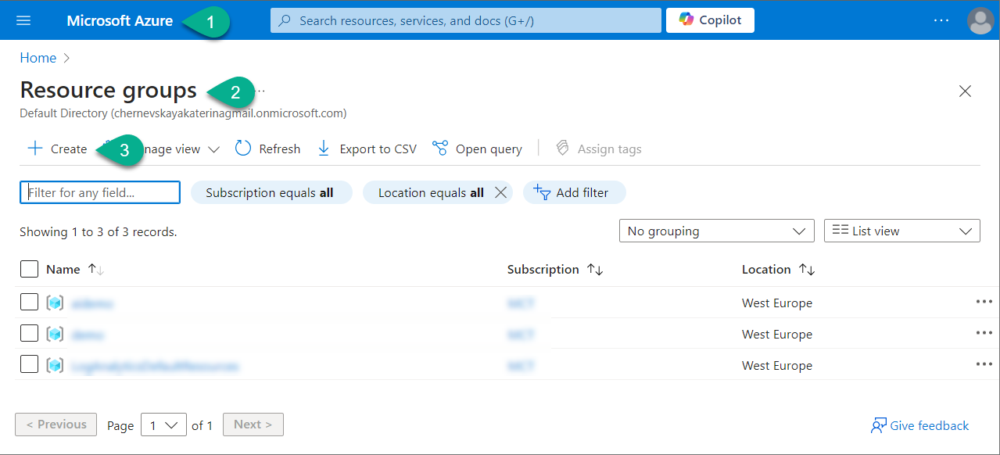

4. Select your dedicated Azure subscription.
5. Enter the resource group name: `bppc-24`.
6. Select region: `Sweden Central`.
7. Click on the `Review + create` button and on the next page click on the `Create` button.

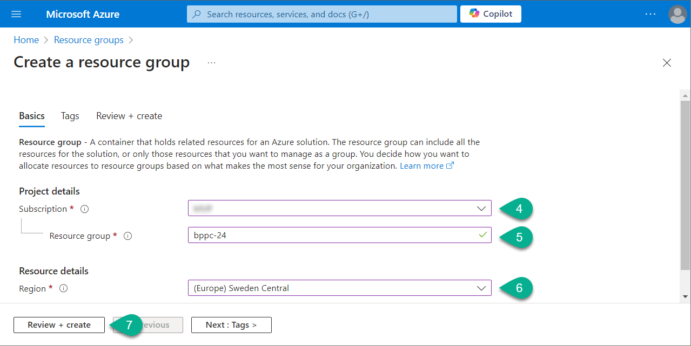

Wait for the creation process to complete.

***

## 2-2. Deploy resources

_In this chapter, we will deploy all the core resources needed to build our solution. We will also configure the necessary connections between the deployed resources to ensure smooth interaction and seamless integration. This foundational setup is crucial for the proper functioning of our solution as we move forward._

We will deploy the following resources:

1. Azure OpenAI with two models - ada and gpt-4.
2. Azure AI Search.
3. Azure AI Hub with depended resources: Azure Application Insights, Azure Blob Storage, Container registry.
4. Azure AI Project.

We will configure the following connections in AI Hub:
1. With Azure OpenAI resource.
2. With Azure AI Search resource.

Follow the below steps to deploy core resources (assume you are already logged into the Azure portal).

### 2-2-1. Deploy Azure OpenAI

1. In the search field enter `openai` and select the `Azure OpenAI` resource.
2. Click `Create`.

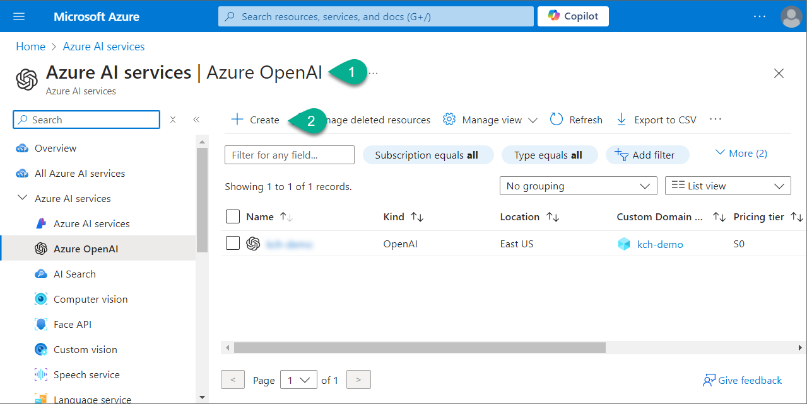

3. Complete the form:
   - **Subscription:** Select your dedicated Azure subscription
   - **Resource group:** Select the resource group you've created before (`bppc-24`)
   - **Region:** Select `Sweden Central`
   - **Name:** Enter `aoi-bppc24`
   - **Price tier:** Select `Standard S0`

4. Click `Next` till the last page, and on the last page click `Create`.

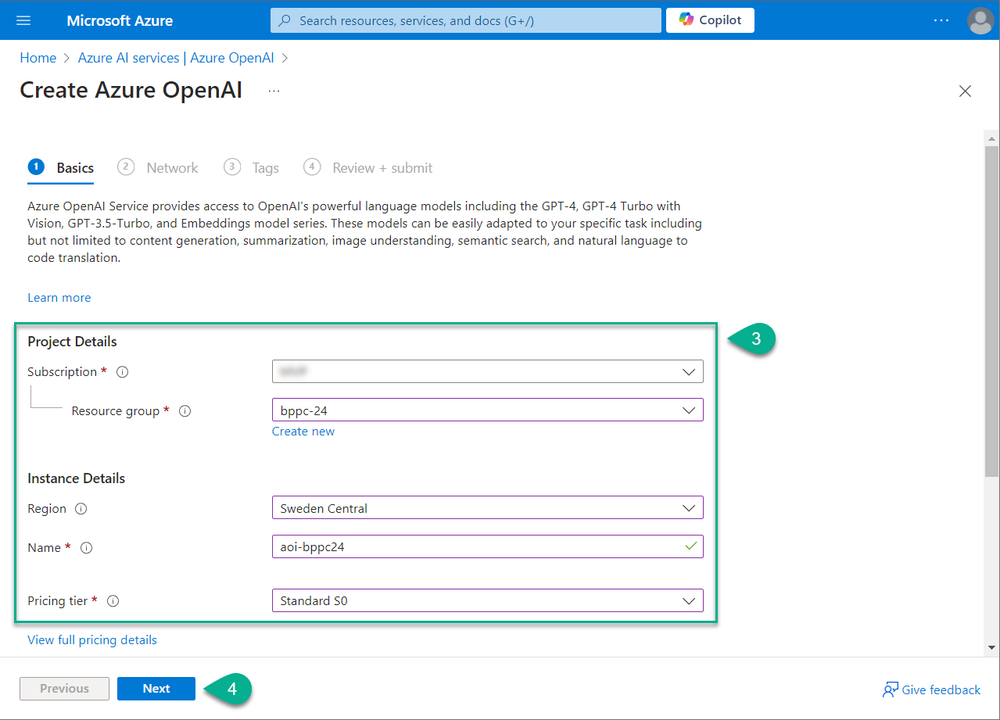

Wait for the deployment process to complete.

### 2-2-2. Deploy models in Azure OpenAI

_We will need two models: Ada for vectorization and GPT for generating completions._

1. Navigate to the Azure OpenAI resource you've created (`aoi-bppc24`) and select `Go to Azure OpenAI Studio`.
2. In the Azure OpenAI Studio navigate to `Deployments`.
3. Click on `Create new deployment` button.
4. Complete the form:
   - **Deployment name:** `ada-bppc24`
   - **Select a model:** Select `text-embeddings-ada-002`
   - Keep other parameters as is
5. Click `Create`.
6. Click on `Create new deployment` button again.
7. Complete the form:
   - **Deployment name:** `gpt4-bppc24`
   - **Select a model:** Select `gpt-4`
   - Keep other parameters as is
5. Click `Create`.

As result of this step you have deployed Azure OpenAI resource with two deployed models - Ada and GPT4.

***

### 2-2-3. Deploy Azure AI Search

1. In the search field enter `ai search` and select the `AI Search` resource.
2. Click `Create`.
3. Complete the form:
   - **Subscription:** Select your dedicated Azure subscription
   - **Resource group:** Select the resource group you've created before (`bppc-24`)
   - **Service name:** Enter `search-bppc24`
   - **Location:** Select `Sweden Central`
   - **Price tier:** Switch to `Basic`

4. Click `Next` till the last page, and on the last page click `Create`.

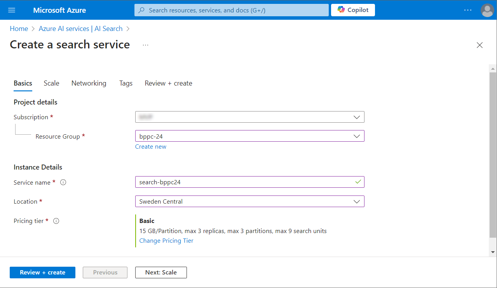

Wait for the deployment process to complete.

***

### 2-2-4. Deploy Azure AI Hub

1. In the search field enter `ai studio` and select the `Azure AI Studio` resource.
2. Click `New Azure AI hub`.
3. Complete the form:
   - **Subscription:** Select your dedicated Azure subscription
   - **Resource group:** Select the resource group you've created before (`bppc-24`)
   - **Region:** Select `Sweden Central`
   - **Name:** Enter `aih-bppc24`
   - **Friendly name:** Enter `AI HUB demo`
   - **Default project resource group:** Select the resource group you've created before (`bppc-24`)
   - **Connect AI Services incl. OpenAI:** Select resource you've deployed (`aoi-bppc24 (swedencentral)`)

4. Click `Next: Storage`.

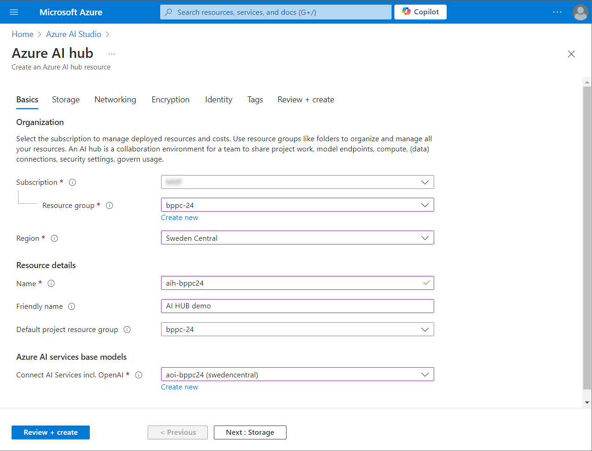

5. Ensure that all four resources will be created as new:
   - Storage account
   - Key vault
   - Application insights
   - Container registry
   
   If any of these resources are not configured to be created - click `Create new` and enter the name for the new resource. For the **Container registry** select **SKU:** `Basic`.

6. Click `Review + create`, and on the last page click `Create`.

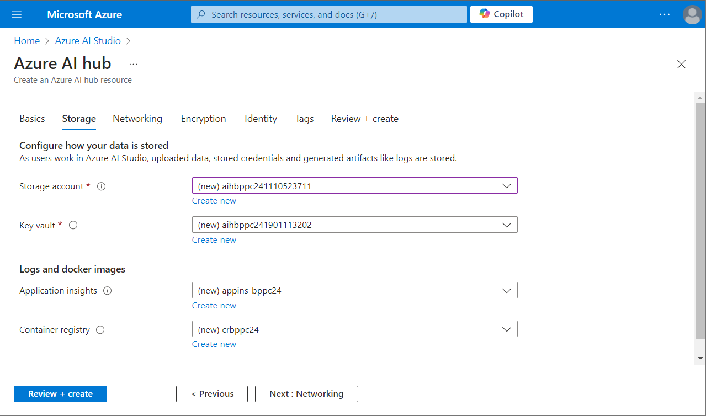

Wait for the deployment process to complete.

***

### 2-2-5. Configure AI Project

1. Navigate to [Azure AI Studio](https://ai.azure.com/).
2. Click `New project`.

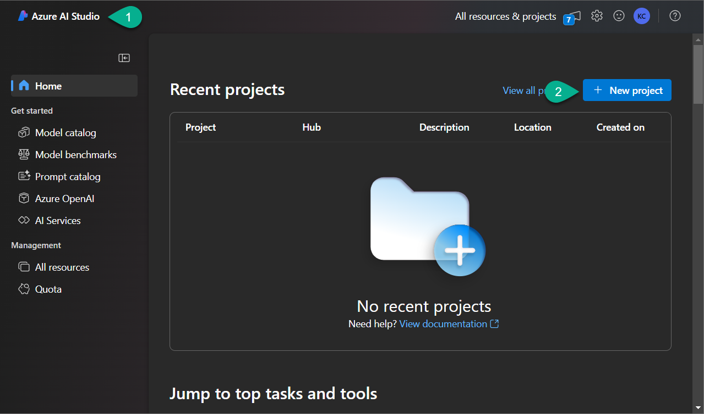

3. Complete the form:
   - **Project name:** `aip-bppc24`
   - **Hub:** Select the AI Hub you've created (`aih-bppc24`)

4. Click `Create a project`.

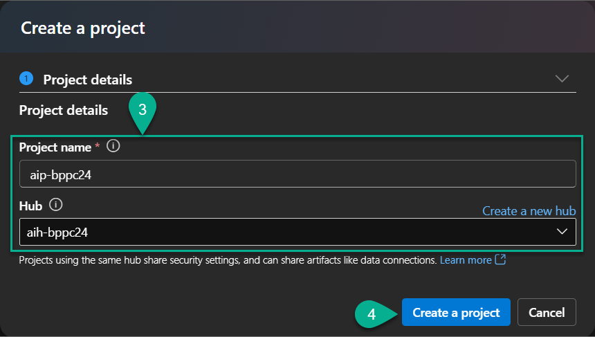

Wait for the deployment process to complete.

***

### 2-2-6. Configure Connections

1. Navigate to the created AI Project `aip-bppc24`.
2. Go to `Settings` and open `Connected resources`.
3. Create a new connection to Azure AI Search by clicking the `New connection` button.

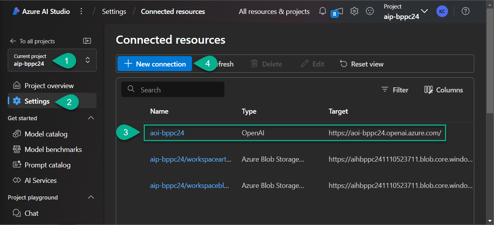

4. Select `Azure AI Search` in the pop-up window.
5. Find Azure AI Search resource you've created (`search-bppc24`) and click `Add connection`.

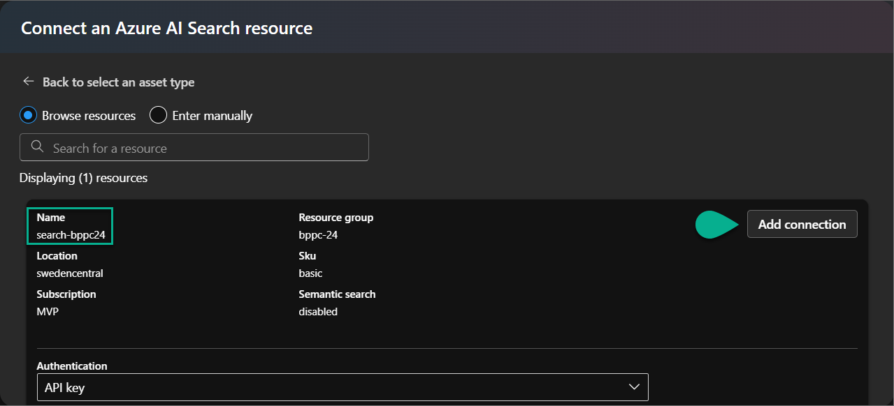

6. Create a new connection to Azure OpenAI by clicking the `New connection` button.
7. Select `Azure OpenAI Service` in the pop-up window.
8. Find Azure AI Search resource you've created (`aoi-bppc24`) and click `Add connection`.

***

