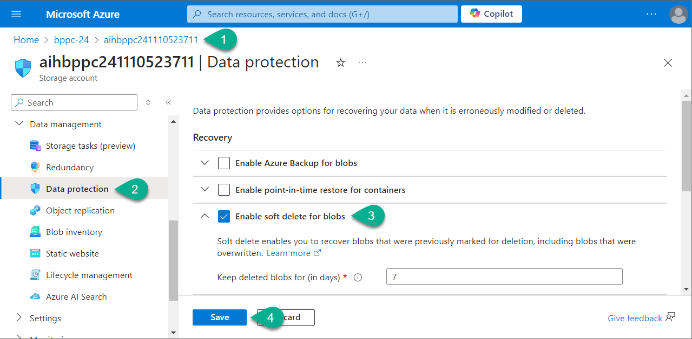
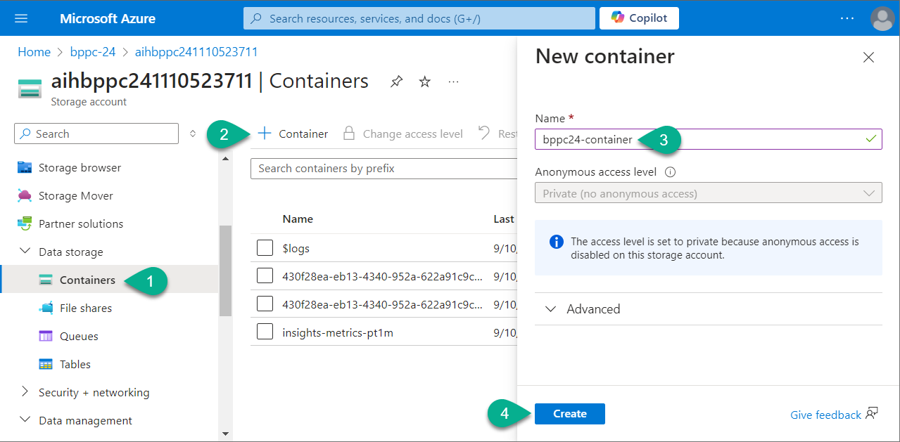
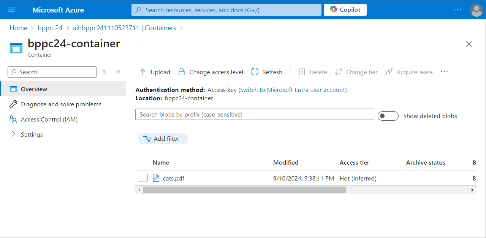

# Lab 3. Upload and manage dataset

_In this lab, we will focus on uploading and managing datasets, which are essential for training and evaluating our models. We'll cover how to organize, store, and efficiently manage datasets within Azure Blob Storage, ensuring that the data is readily available for the Prompt Flow in Azure AI Studio. Proper dataset management is crucial for maintaining data integrity and optimizing model performance._

***

## 3-1. Enable soft delete for blobs

_The `Enable soft delete` option in Azure Blob Storage helps protect your data from accidental deletions. When soft delete is enabled, deleted blobs or blob snapshots are not permanently removed immediately. Instead, they are retained for a specified period, allowing you to recover them if needed. This feature acts as a safety net, giving you time to restore deleted data before it is permanently purged from the system, helping prevent data loss. Additionally, it ensures proper chunks deletion process once a document deleted from the Azure Blob Storage._

1. Navigate to your dedicated Azure subscription and open Azure Blob Storage resource you've created in the **Lab 2**.
2. Find and open to `Data protection` section.
3. Turn on `Enable soft delete for blob` option.
4. Hit `Save` button.

***

## 3-2. Create a container

_Containers serve as folders for your documents._

1. In the Azure Blob Storage navigate to `Containers` section.
2. Click `Container`.
3. Enter the container name: `bppc24-container`.
4. Click `Create`.

***

## 3-3. Upload training dataset

1. Open the container you've created.
2. Click `Upload`.
3. Add three files. You can download these files [here](./assets/dataset-training.zip). Unzip them before upload.
4. Click `Upload`.

After upload process completed you should see this file in the container:

***