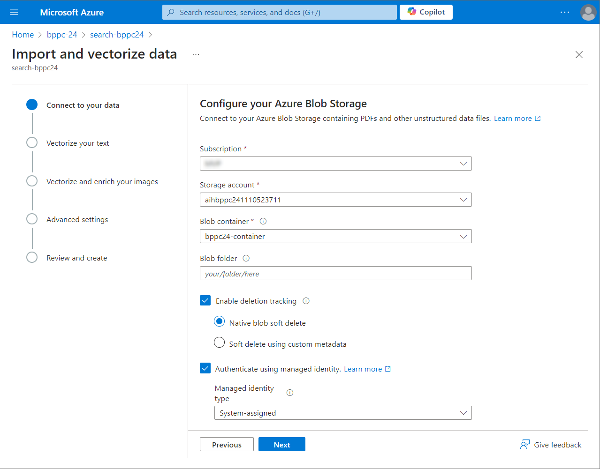
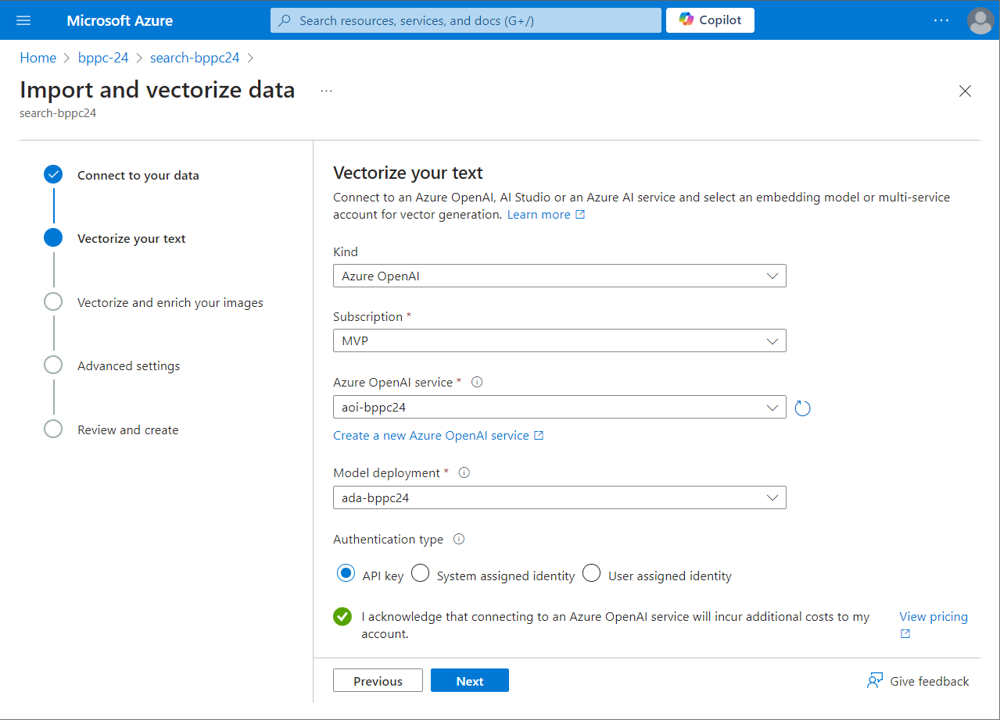
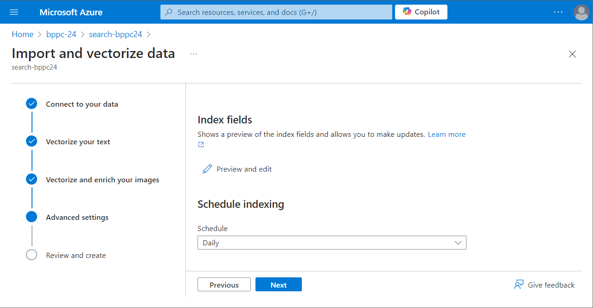
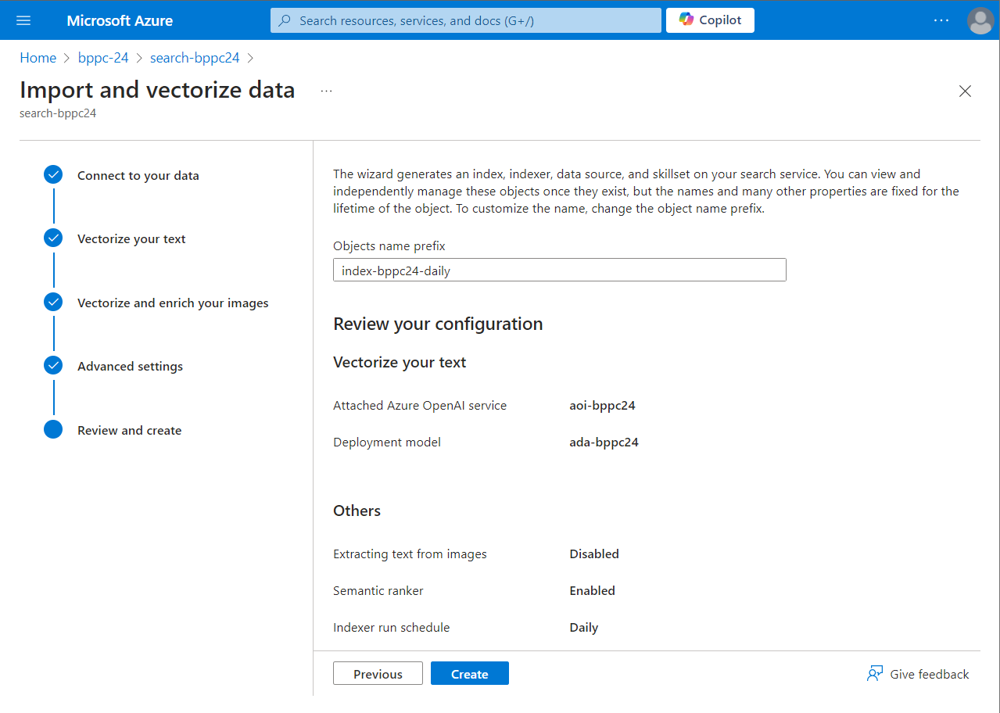
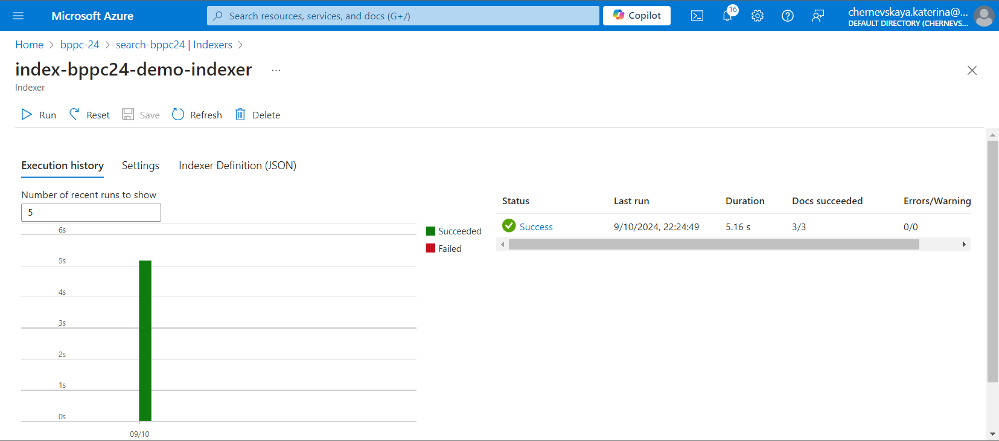

# Lab 4. Configure key components in Azure AI Search

_On this step, we will configure the key components in Azure AI Search: index, indexer, data source, and vector. Using Azure's built-in wizard, we will streamline the setup process to ensure efficient search functionality. The index will serve as the structure for storing and retrieving data, the indexer will automate data updates, and the data source will define where the information is coming from. Finally, we will configure vector for enhanced relevance and accuracy in search results._

1. Navigate to the AI Search resource (`search-bppc24`) you've created during the Lab 2.
2. Click `Import and vectorize data`.
3. Complete the form:
   - Select `Azure Blob Storage`
   - Select your dedicated Azure subscription
   - Select the Azure Blob Storage resource you've create in the lab 2
   - Select the container with your training data set
   - Turn on `Enable deletion tracking`
   - Turn on `Authenticate using managed identity`
4. Click `Next`.

5. Complete the form on the next page:
   - **Kind:** `Azure OpenAI`
   - **Subscription:** Select your dedicated Azure subscription
   - **Azure OpenAI service:** Select the Azure OpenAI resource you've created in the Lab2 (`aoi-bppc24`)
   - **Model deployment:** Select the Ada model you've deployed (`ada-bppc24`)
   - Mark checkbox `I acknowledge that connecting to an Azure OpenAI service will incur additional costs to my account`
6. Click `Next`.

7. On the `Advanced settings` page:
   - Click **Preview and edit**, and add new column `metadata_storage_path`
   - Set **Schedule** to `Daily`, and click `Next`.

8. On the last page in the field **Object name prefix** enter `index-bppc24-daily`, and click `Create`.

9. Once Indexer finished its run, ensure that there are no warnings or errors.

***