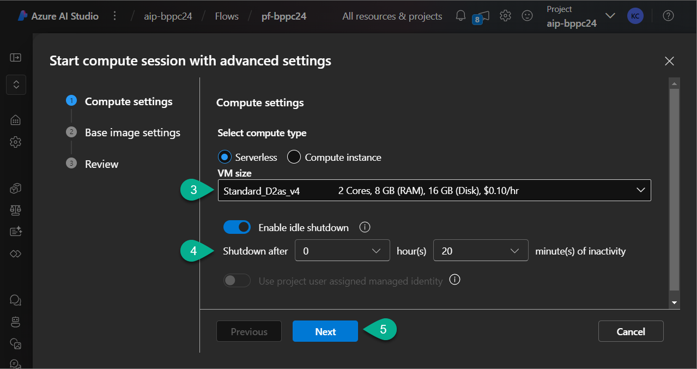

# Lab 5. Create a Prompt Flow

_Prompt Flow in Azure AI Studio is a framework that guides the generation of AI models' responses. It structures the interaction by defining a sequence of steps to achieve more refined and contextually appropriate outputs._

***

## 5-1. Create a Prompt Flow from template

1. Navigate to [Azure AI Studio](https://ai.azure.com/) and open the AI Project you've created earlier (`aip-bppc24`).
2. Select `Prompt Flow` on the left-hand pane.
3. Click `Create`.

4. Select `Multi-Round Q&A on Your Data` and click `Clone`.
5. Enter the flow name `pf-bppc24` and hit `Clone`.

Once the Prompt Flow will be cloned, you will see it:

***

## 5-2. Run Compute session

_A Compute Instance in Azure AI Studio's Prompt Flow is a dedicated virtual machine that provides the necessary compute power for running experiments, developing models, and executing workflows in your AI projects. It is used for tasks like evaluation, enabling you to run code interactively or automate pipelines. Compute instances offer flexibility in scaling resources based on the computational needs of your project, ensuring you have sufficient processing power for tasks like prompt engineering and model fine-tuning in Azure AI Studio._

1. In the Prompt Flow canva click on drop-down next to `Start Compute session`.
2. Select `Start with advanced settings`.

3. Select **VM size**. For instance `Standard_D2as_v4`.
4. Set **Shutdown after** parameter value: `20 minutes`.
5. Click `Next` till the last screen. On the last screen click `Apply and start compute session`.

Wait when compute session will be started.

***

## 5-3. Update Prompt Flow tools

When compute session started follow these steps to update tools in your Prompt Flow:

1. Navigate to the tool `modify_query_with_history`.
2. In the field **Connection** select your connection (`aoibppc24`).
3. In the field **model** select the GPT4 model (`gpt4-bppc24`).

4. Navigate to the tool `chat_with_context`.
5. In the field **Connection** select your connection (`aoibppc24`).
6. In the field **model** select the GPT4 model (`gpt4-bppc24`).

7. Navigate to the tool `lookup`.
8. Select the Value field for the field `mlindex_content` and complete the form:
   - **index_type:** `Azure AI Search`
   - **acs_index_connection:** `searchbppc24`
   - **acs_index_name:** `index-bppc24-daily`
   - **acs_content_field:** `chunk`
   - **acs_embedding_field:** `text_vector`
   - **acs_metadata_field:** `metadata_storage_path`
   - **semantic_configuration:** `index-bppc24-daily-semantic-configuration`
   - **embedding_type:** `Azure OpenAI`
   - **aoai_embedding_connection:** `aoibppc24`
   - **embedding_deployment:** `ada-bppc24`
9. Click `Save`.
10. For the field **query_type** in the **lookup** tool select `Hybrid (vector + keyword)`.
11. Save the Prompt Flow.

***