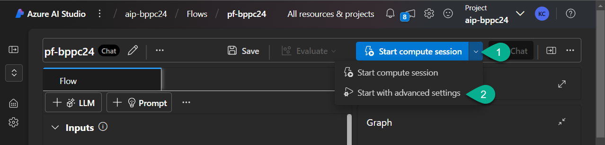
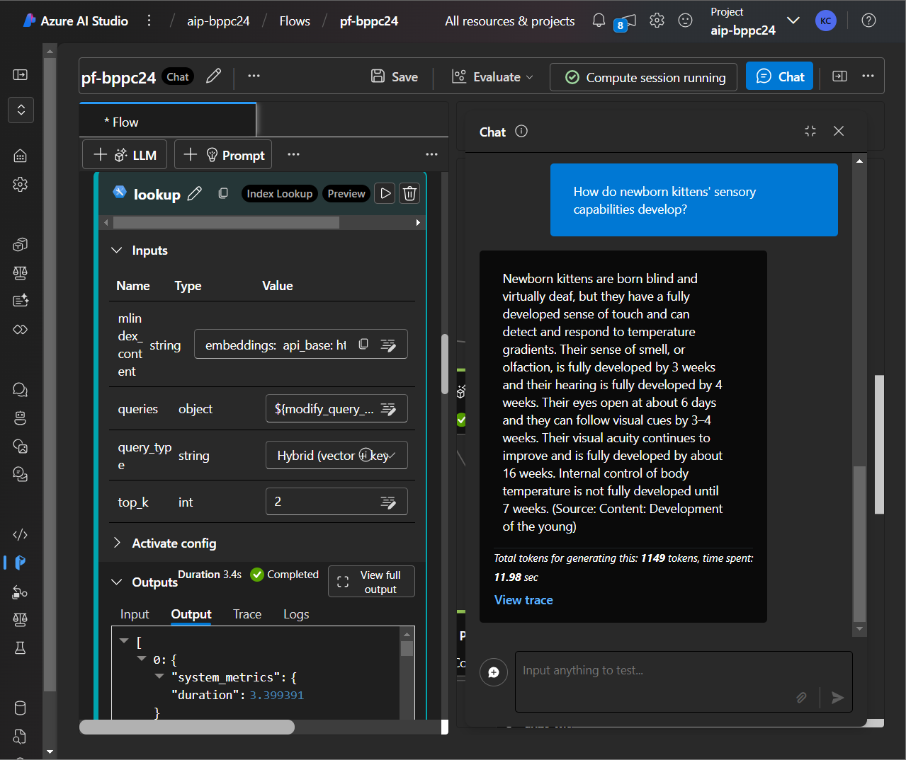
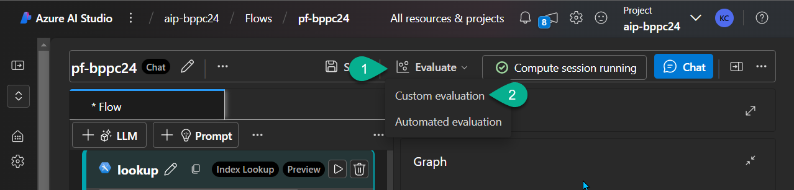
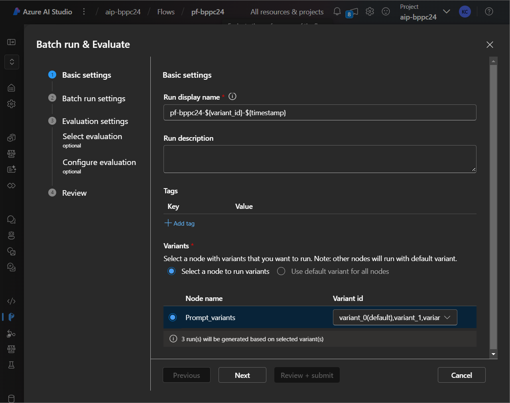
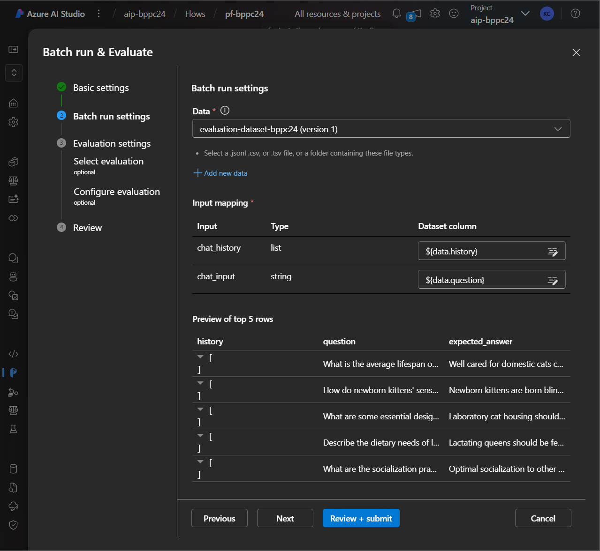
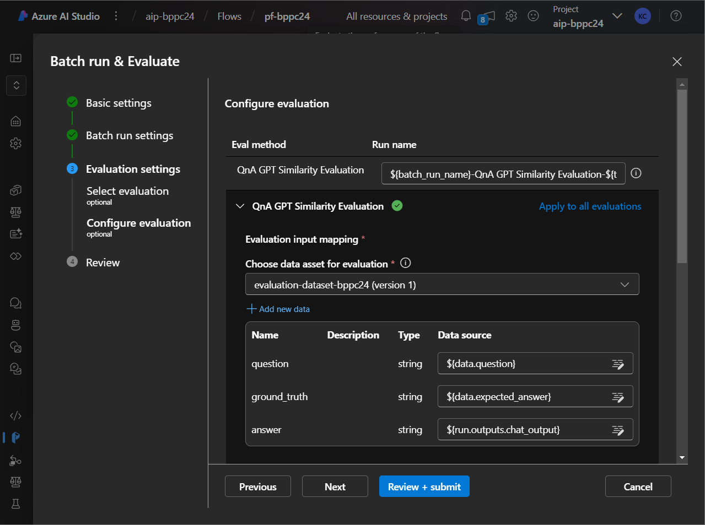
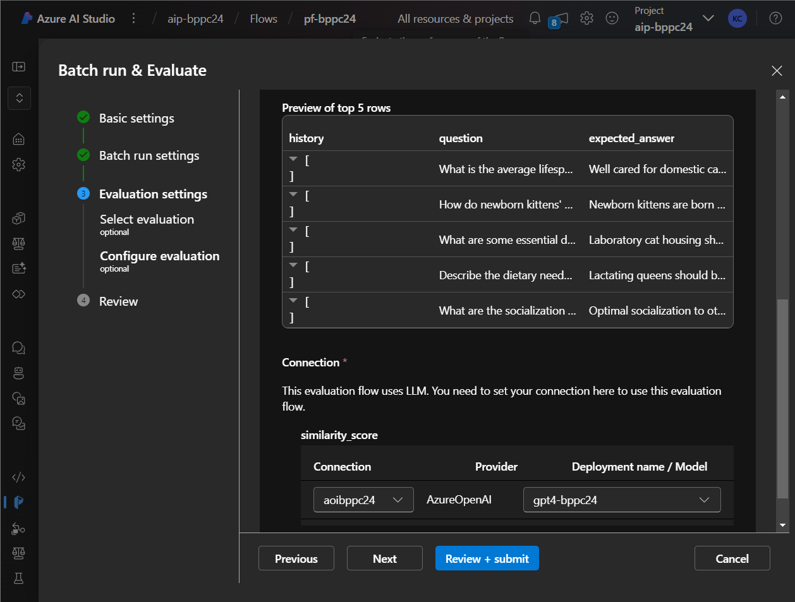
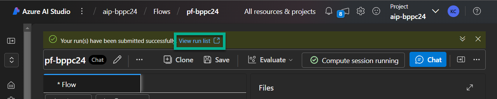

# Lab 6. Evaluate the Prompt Flow

_The process of assess the effectiveness and accuracy of the AI responses generated within the flow. It's essential for ensuring the responses meet the intended requirements._

***

## 6-1. Run Compute session (if the session has been stopped)

1. In the Prompt Flow canva click on drop-down next to `Start Compute session`.
2. Select `Start with advanced settings`.



3. Select **VM size**. For instance `Standard_D2as_v4`.
4. Set **Shutdown after** parameter value: `20 minutes`.
5. Click `Next` till the last screen. On the last screen click `Apply and start compute session`.


Wait when compute session will be started.

***

## 6-2. Test the flow in Chat

1. Open **Chat**.
2. Start a new session in the chat.
3. Send the message in the chat: `How do newborn kittens' sensory capabilities develop?`

You should receive an answer like this:
```
Newborn kittens are born blind and virtually deaf, but they have a fully developed sense of touch and can detect and respond to temperature gradients. Their sense of smell, or olfaction, is fully developed by 3 weeks and their hearing is fully developed by 4 weeks. Their eyes open at about 6 days and they can follow visual cues by 3–4 weeks. Their visual acuity continues to improve and is fully developed by about 16 weeks. Internal control of body temperature is not fully developed until 7 weeks. (Source: Content: Development of the young)
```



***

## 6-3. Run evaluation

Before proceed, ensure that the **compute session** is running. If not - please runn the session in advance.

1. In the Prompt Flow window select the drop-down menu next to `Evaluate`.
2. Select `Custom evaluation` option.



3. On the **Basic settings** screen select `Prompt_variants` and select all three variants.



4. On the **Batch run settings** page:
   - Upload a new data set for evaluation. You can download this file [here](./assets/evaluation_questions.csv)
   - for the **chat_history** select `${data.history}`; for the **chat_input** select `${data.question}`



5. On the **Evaluation settings** page select `QnA GPT Similarity Evaluation`.

6. Map the fields:
   - **question:** `${data.question}`
   - **ground_truth:** `${data.expected_answer}`
   - **answer:** `${run.outputs.chat_output}`



7. Select for **Connection** your connection to Azure OpenAI `aoibppc24`; for **Deployment name / Model** select `gpt4-bppc24`.



8. On the last page click `Review + submit`.

9. Once the evaluation started, click on the link `View run list` to monitore the evaluation process.



***
