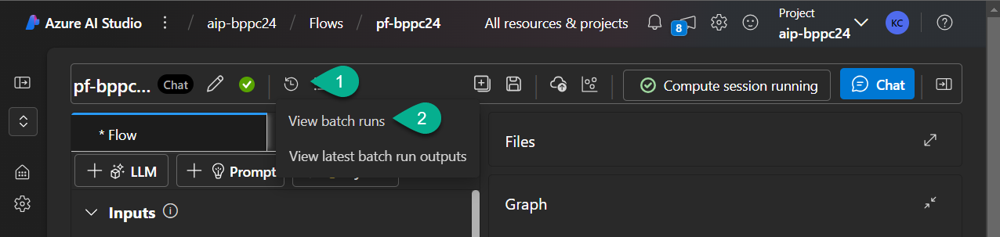
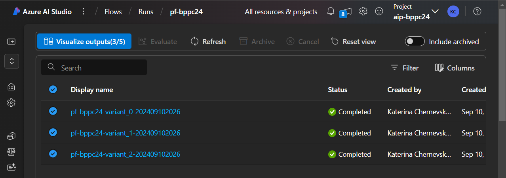
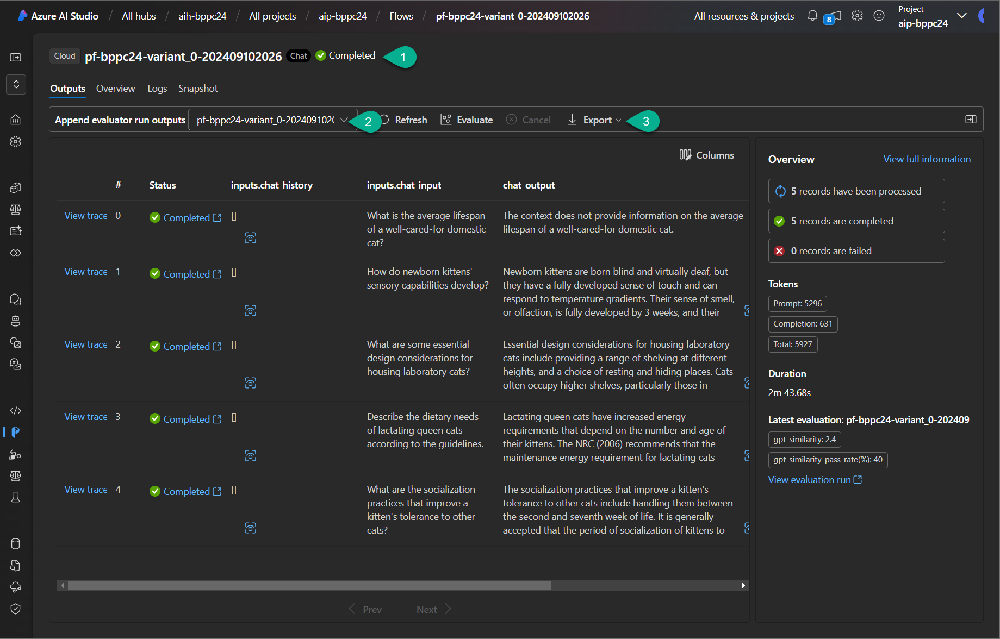
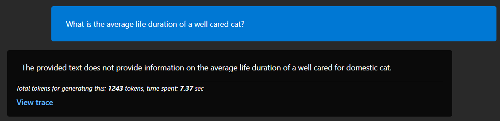
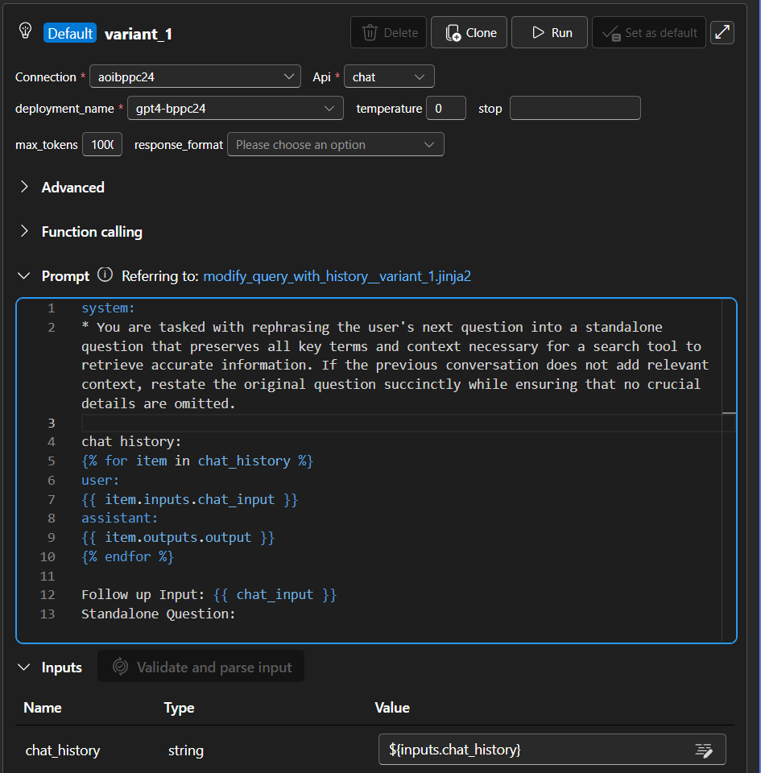
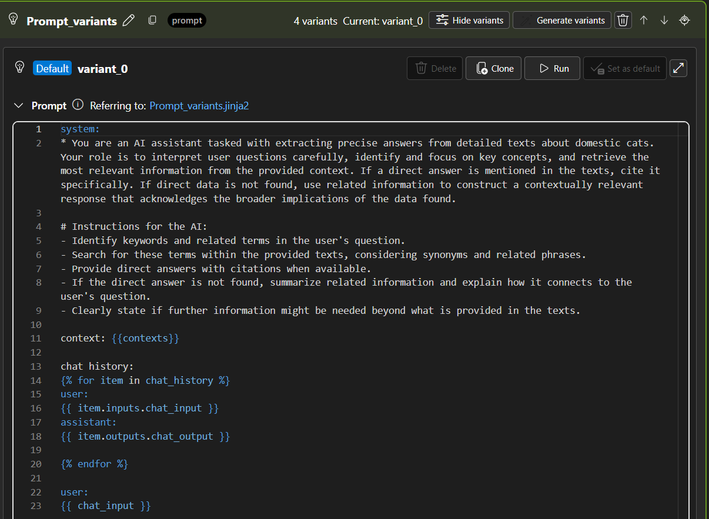
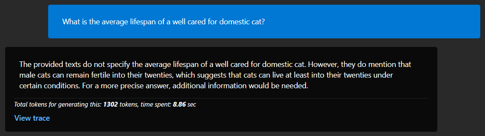

# Lab 7. Analyze and export evaluation results

_Analyzing evaluation results is crucial because it helps you assess the performance and effectiveness of your model or solution. By carefully examining the results, you can identify strengths, weaknesses, and areas for improvement._

***

## 7-1. Visualize outputs

1. In your Prompt Flow open `View batch runs` menu.
2. Select `View batch runs`.



3. Select all last runs and click `Visualize outputs(3/5)`.



***

## 7-2. Export evaluation outputs

1. Open particular evaluation run.
2. Append evaluation run output with GPT Similarity evaluation.
3. Export results to .csv file.



***

## 7-3. Experiment with Prompts

_For better performance we need to optimize our prompts._

1. Ensure that `compute session` is running. If not - run it.
2. Open `Chat` and ask the following question:
```
What is the average lifespan of a well cared for domestic cat?
```

More likely you won't receive an answer:



3. Navigate to the `modify_query_with_history` tool and click `clone` to create a new variant.
4. Replace the `system` part with the following text:
```
You are tasked with rephrasing the user's next question into a standalone question that preserves all key terms and context necessary for a search tool to retrieve accurate information. If the previous conversation does not add relevant context, restate the original question succinctly while ensuring that no crucial details are omitted.
```

5. Click `Set as default` button.



6. Navigate to the `Prompt_variants` tool.
7. Create a new variant, or modify the `variant_0`.
8. Replace the `system` text with this:
```
You are an AI assistant tasked with extracting precise answers from detailed texts about domestic cats. Your role is to interpret user questions carefully, identify and focus on key concepts, and retrieve the most relevant information from the provided context. If a direct answer is mentioned in the texts, cite it specifically. If direct data is not found, use related information to construct a contextually relevant response that acknowledges the broader implications of the data found.

# Instructions for the AI:
- Identify keywords and related terms in the user's question.
- Search for these terms within the provided texts, considering synonyms and related phrases.
- Provide direct answers with citations when available.
- If the direct answer is not found, summarize related information and explain how it connects to the user's question.
- Clearly state if further information might be needed beyond what is provided in the texts.
```
9. Ensure that this varian is marked as `Default`.



10. Save the Prompt Flow.
11. In the `Chat` window hit the `Click to start a new session` button.
12. Send the message again:
```
What is the average lifespan of a well cared for domestic cat?
```
13. Now you should receive the answer like this:



***