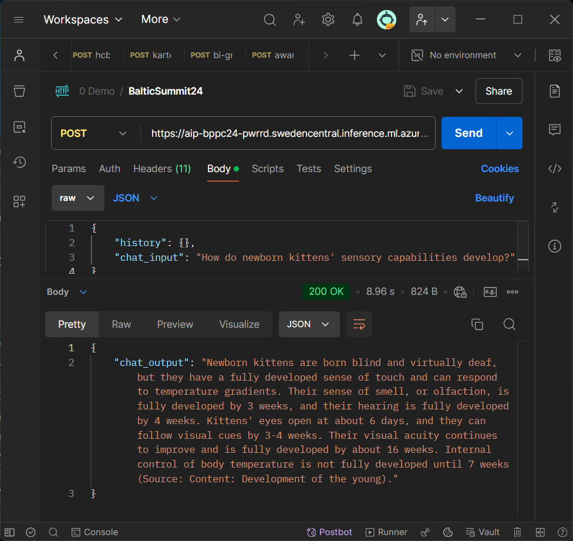

# Lab 8. Deploy endpoint

_In this lab, we will focus on deploying an endpoint, which is essential for making your Prompt Flow accessible for real-time use. An endpoint allows you to integrate the flow with applications and services by providing a RESTful API interface. This enables scalable, on-demand predictions and makes it easy to share your model with others. Additionally, deploying an endpoint offers benefits such as monitoring, version control, and security features, ensuring reliable and controlled access to your AI solution in production environments._

***

## 8-1. Deploy endpoint

Before proceed, ensure that the **compute session** is running. If not - please runn the session in advance.

1. Open your Prompt Flow.
2. Click on the `Deploy` button.


3. Complete the form:
   - On the **Basic settings** screen scpecify the `Endpoint name`, `Deployment name` and select required `Virtual machine`. For the workshop purpose you can select the cheapest one.
   - On the **Endpoint** screen keep all values as-is. You can add tags for the endpoint.
   - On the **Deployment** page enable `Application Insights diagnostics`. You can also add tags.
   
   - On the **Outputs & connections** page check that all parameters selected correctly.
   
4. On the last page of the form click `Create` to start the provisioning process.

Provisioning process may take several minutes. Once it will be completted you will be notified through the interface.


***

## 8-2. Consume endpoint in Postman

1. In Azure AI Studio navigate to `Deployment` and open the deployment you've create on the previous step.
2. Open the `Consume` tab.
3. Prepare the API request in Postman:
   - **Method:** `POST`
   - **URL:** <YOUR_URL> (Copy from the `REST endpoint` field)
   - **Headers:**
      - Content-Type: application/json
      - Authorization: Bearer <YOUR_KEY>
      - azureml-model-deployment: <YOUR_MODEL_NAME>
      >> For <YOUR_KEY> - copy `Primary key` value
      >> For <YOUR_MODEL_NAME> - copy the name of your deployment
      
   - **Body:** Switch to `raw` and past this text:
   ```
   {
    "history": {},
    "chat_input": "How do newborn kittens' sensory capabilities develop?"
   }
   ```
4. Save the request and hit `Send` button.
5. You should receive the response like this:


***